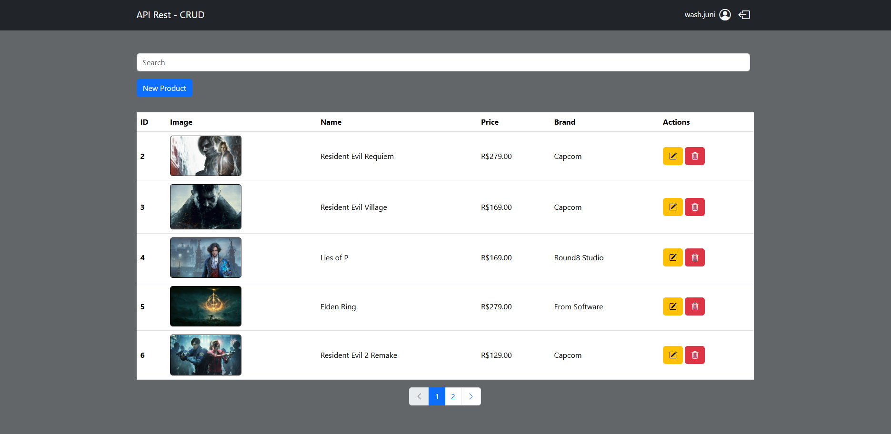
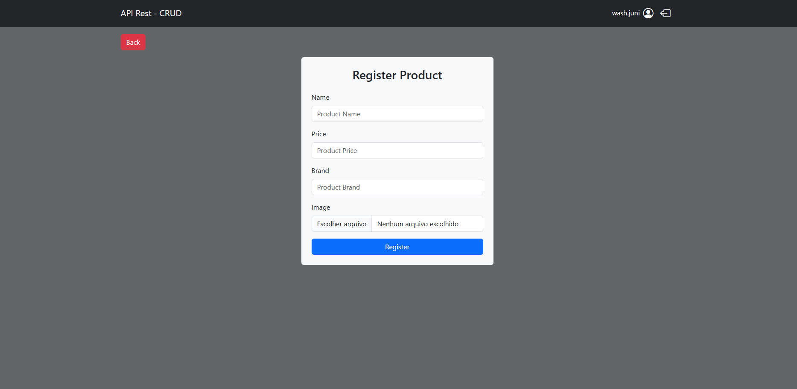
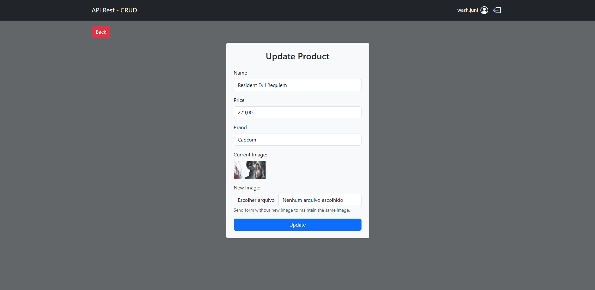
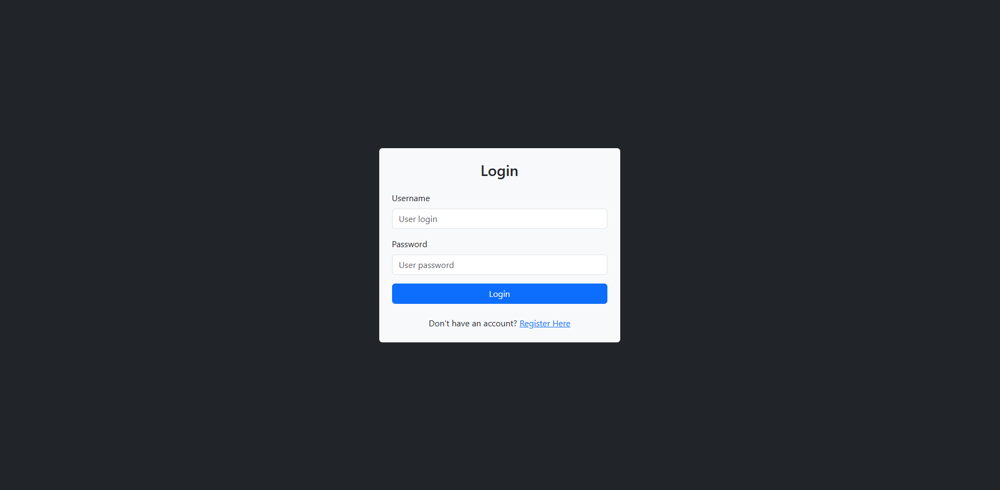
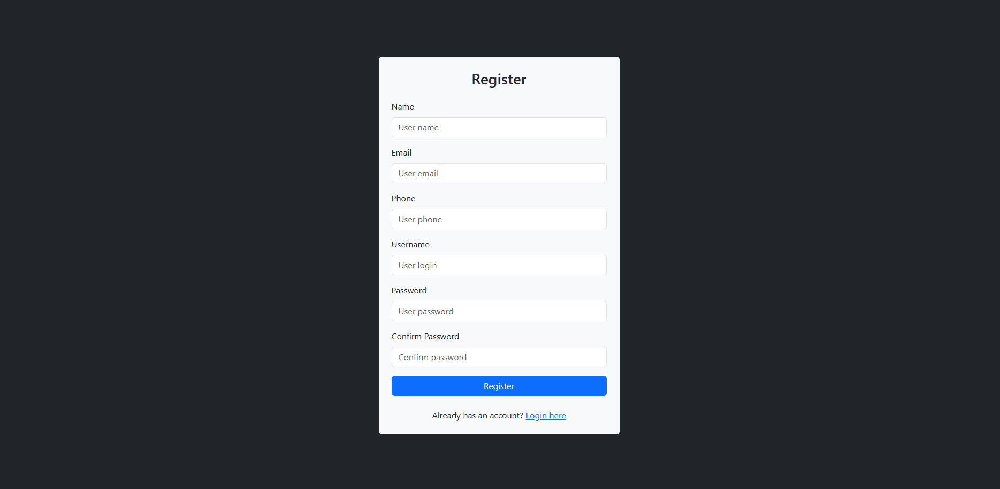
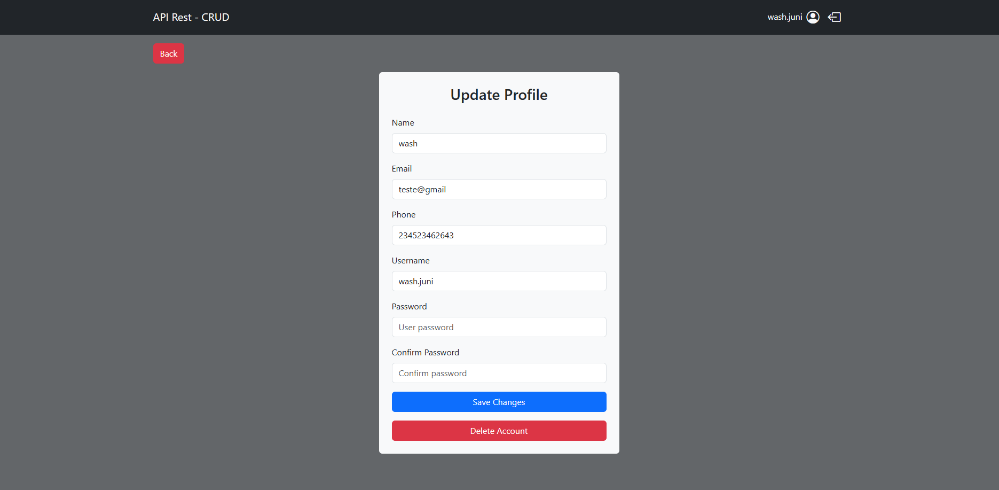

# 🚀 API Rest CRUD - Gerenciamento de Produtos

Este é um sistema completo de gerenciamento de produtos com autenticação de usuários, desenvolvido para demonstrar a aplicação de padrões de projeto modernos em **PHP** e a integração fluida com **JavaScript (Fetch API)**. O projeto segue a arquitetura MVC e utiliza padrões como Service Layer e Repository para garantir código limpo e escalável.

> **Visão de Futuro:** O projeto foi arquitetado de forma modular sob o padrão MVC, possuindo total margem para crescimento e escalabilidade, podendo ser facilmente expandido para uma plataforma de **e-commerce completa**.

🔗 **[Acesse a Demo ao Vivo aqui](https://api-rest-products.infinityfreeapp.com)**

Usuário | Senha
| :--- | :--- |
| `user` | `123456` |

---

## 📸 Screenshots

### Home Page & Busca em Tempo Real com Paginação

*Interface principal com listagem de produtos, paginação dinâmica e busca instantânea.*

### Gerenciamento de Produtos
<p align="center">
  
  
</p>
*Fluxo completo de criação e edição de produtos com suporte a upload de imagens.*

### Autenticação & Perfil do Usuário
<p align="center">
  
  
  
</p>
*Área de autenticação de usuários com segurança e opção de gerenciamento de conta (atualização e exclusão).*

---

## 🛠️ Tecnologias e Padrões Utilizados

### Back-end
* **PHP 8.x**: Processamento no lado do servidor.
* **Arquitetura MVC**: Separação de responsabilidades (Model, View, Controller).
* **Service Layer**: Camada de lógica de negócio para desacoplamento.
* **Repository Pattern**: Abstração da persistência de dados via **PDO**.
* **Rotas Inteligentes**: Sistema de roteamento amigável via `.htaccess`.
* **API REST**: Endpoints que fornecem dados em formato JSON.

### Front-end
* **JavaScript (ES6+)**: Lógica de interface e manipulação assíncrona.
* **Fetch API**: Comunicação com o back-end sem recarregar a página (SPA feel).
* **Bootstrap 5**: Design responsivo e componentes UI modernos.
* **Interatividade**: Modais de confirmação para ações sensíveis (exclusão).

---

## ⚙️ Funcionalidades Principais

* **🔒 Autenticação Completa**: Cadastro de novos usuários e sistema de login seguro.
* **👤 Gestão de Perfil**: O usuário pode atualizar seus dados ou excluir sua própria conta.
* **📦 CRUD de Produtos**:
    * Listagem com **Paginação Customizada** (limite de botões visíveis).
    * Busca global por ID, Nome, Preço ou Marca.
    * Upload e processamento de imagens de produtos.
    * Edição inteligente (mantém a imagem atual se uma nova não for enviada).
    * Exclusão segura com confirmação em modal.

---

## 🚀 Como rodar o projeto localmente

1.  **Clone o repositório:**
    ```bash
    git clone [https://github.com/seu-usuario/api-rest-products.git](https://github.com/seu-usuario/api-rest-products.git)
    ```
2.  **Configuração do Banco de Dados:**
    * Importe o banco de dados via phpMyAdmin (arquivo SQL incluso).
    * Configure as credenciais em `App/Config/Connection.php`.
3.  **Configuração de URL:**
    * No arquivo `public/index.php`, ajuste a constante `BASE_URL` para o caminho da sua pasta local (ex: `/api-rest-products`).
4.  **Acesso:**
    * Certifique-se de que o Apache está com o `mod_rewrite` ativado para as rotas funcionarem.

---

## 👨‍💻 Autor

<h3 align="left">Washington Walmick Penafort Júnior</h3>
<h5 align="left">Bacharel em Sistemas de Informação & Técnico de Suporte de TI</h5>
<p align="left">
  <a href="https://www.linkedin.com/in/washington-junior-bb1540245/" target="_blank">
    
  </a>
  <a href="mailto:washjunior4444@gmail.com">
    
  </a>
</p>

---
